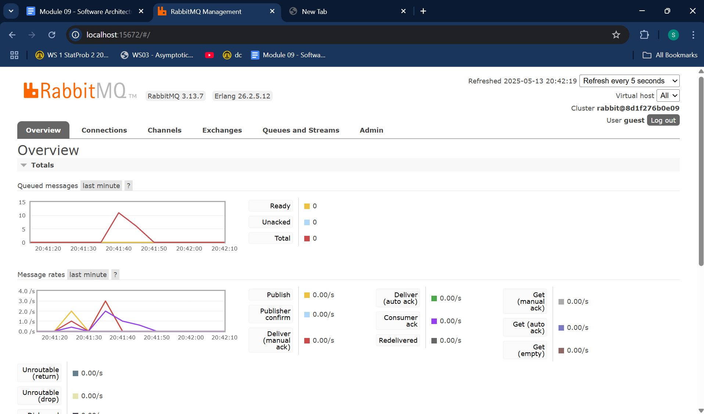
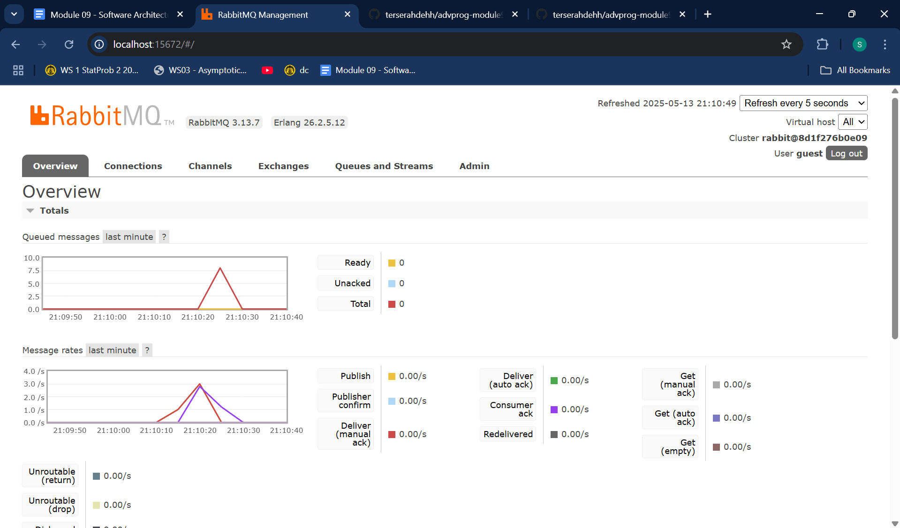

#### 1. What is amqp?
AMQP stands for Advanced Message Queuing Protocol. It’s a set of rules for sending messages between different programs. AMQP makes sure messages arrive safely, even if the sender and receiver aren’t active at the same time. It uses a common format so different tools can understand each other. Because many servers and libraries speak AMQP, it’s widely used in business systems.

#### 2. What does it mean? guest:guest@localhost:5672 , what is the first guest, and what is the second guest, and what is localhost:5672 is for? 

The text guest:guest@localhost:5672 gives login details and the server location for an AMQP connection. The first guest is the username, and the second guest is the matching password. localhost means the server is running on the same machine as the application. The number 5672 is the default port where the AMQP service listens for connections. Altogether, this string tells the application how to reach the message broker and log in

### Simulation slow subscriber

The dashboard showed a peak of 16 messages in the queue. This happened because the publisher published faster than the subscriber could process. Messages accumulated until the subscriber caught up and consumed each one.

### Reflection and Running at least three subscribers

#### Add some explanation/reflection of why it is like that

The queue briefly peaked at 9 messages before dropping back to zero. The publisher pushed messages rapidly while three subscribers processed them in parallel. This parallel processing boosted throughput and cleared the backlog much faster than a single subscriber alone.